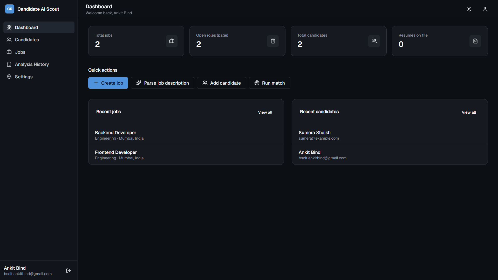
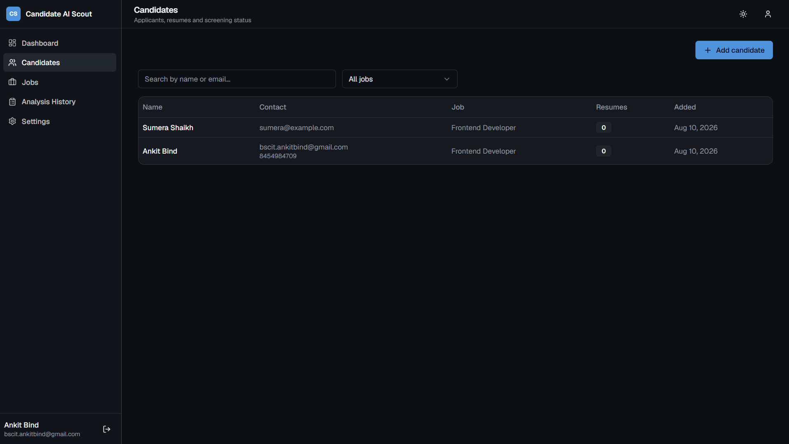
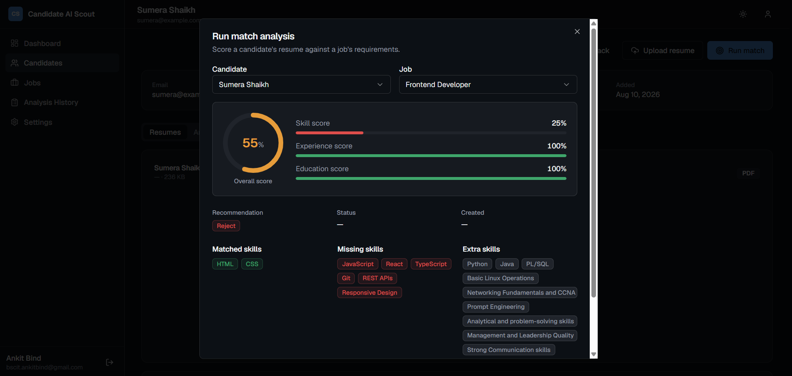
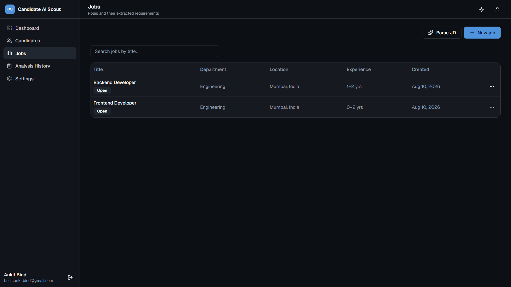

# Candidate AI Scout

Candidate AI Scout is an AI-powered recruitment and candidate screening platform that helps recruiters analyze job descriptions, extract structured information from resumes, and automatically match candidates with suitable job roles.

The platform reduces manual resume screening by comparing candidate skills, experience, and education against job requirements and generating an overall compatibility score.

## Live Demo

- **Frontend:** https://candidate-ai-scout-mocha.vercel.app
- **Backend API:** https://candidate-ai-scout.onrender.com
- **API Documentation:** https://candidate-ai-scout.onrender.com/docs
- **GitHub:** https://github.com/AnkitBind21/candidate-ai-scout

## Screenshots

### Dashboard

<p align="center">
  
</p>


### Candidate Profile

<p align="center">
  
</p>


### Match Analysis

<p align="center">
  
</p>

### Jobs

<p align="center">
  
</p>

## Features

- Create and manage job openings
- Parse job descriptions into structured requirements
- Upload candidate resumes in PDF and DOCX formats
- Extract skills, education, experience, projects, and other resume entities
- Analyze candidates against specific job requirements
- Generate skill, experience, education, and overall matching scores
- Display matched, missing, and additional skills
- Candidate and job management
- Authentication and protected routes
- PostgreSQL database integration
- REST API architecture
- Responsive web interface
- Production deployment support

## How It Works

### 1. Create a Job

Recruiters can create a job by providing:

- Job title
- Department
- Location
- Employment type
- Minimum experience
- Maximum experience
- Required skills
- Job description

The job description can also be parsed to extract structured requirements automatically.

### 2. Upload Candidate Resumes

Recruiters can upload candidate resumes in supported formats such as PDF and DOCX.

The system extracts structured information including:

- Skills
- Education
- Experience
- Projects
- Certifications

### 3. Match Candidates

A recruiter can select a candidate and a job and run a matching analysis.

The system compares the extracted candidate information with the requirements of the selected job.

### 4. Review the Analysis

The matching analysis provides:

- Overall score
- Skill score
- Experience score
- Education score
- Matched skills
- Missing skills
- Extra skills
- Recommendation
- Matching status

This allows recruiters to quickly identify candidates who are most relevant to a particular role.

## Architecture

```text
                    Candidate AI Scout
                           |
             +-------------+-------------+
             |                           |
        Frontend                      Backend
             |                           |
     React + TypeScript              FastAPI
             |                           |
             +-------------+-------------+
                           |
                      PostgreSQL
                           |
             +-------------+-------------+
             |                           |
       Resume Extraction           Job Parsing
             |                           |
             +-------------+-------------+
                           |
                    Matching Engine
                           |
                 Candidate Match Score
